```{r, include = FALSE}
knitr::opts_chunk$set(tidy = TRUE, comment = "#R: ")

library(knitr)
library(kableExtra)
library(tidyverse)
```

## Topics covered

- Why version control?
- Git as a version control system.
- GitHub as a cloud-based management system.
- Git and GitHub basics.
- Examples to follow.

All that is required is RStudio, a browser, and an internet connection.

# Version control

## What is a version control system (VCS)?

- A system that tracks the changes to your files through time.
- 'Track changes' in Microsoft Word is a rudimentary type of version control.
- You've likely tried to implement your own system before (thesis_FINALLLL.docx).
- A good VCS should have a unique identifier showing:

    + What changed?
    + When?
    + Who?
    + Why?

## Why should I use a version control system?

1. Safety

    + Fail more safely (can go back in time).
    + Everything is tracked so you can undo an undo.
    + Fail more quickly (continuous integration).
    + Get to a successful place much faster.

2. Community

    + There is a large community out there to help you and to benefit from your project.
    
For more on this, see the talk by [Hadley](https://www.rstudio.com/resources/webinars/collaboration-and-time-travel-version-control-with-git-github-and-rstudio/).

# Git as a version control system

## Why should I git?

- Free, open-source VCS.
- Can work offline.
- Every developer has their own, complete codebase.
- By far the most popular:

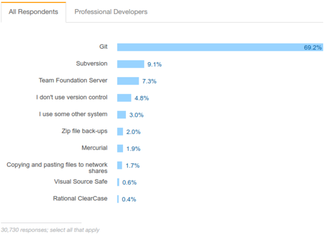

## Version control with git:

- A unique identifier (SHA for each 'save') gives info on:

    + What changed?
    + When?
    + Who?
    + Why?

# Obtaining git

## Check if you already have git installed

In RStudio:

File $\rightarrow$ New Project $\rightarrow$ Version Control $\rightarrow$ Git

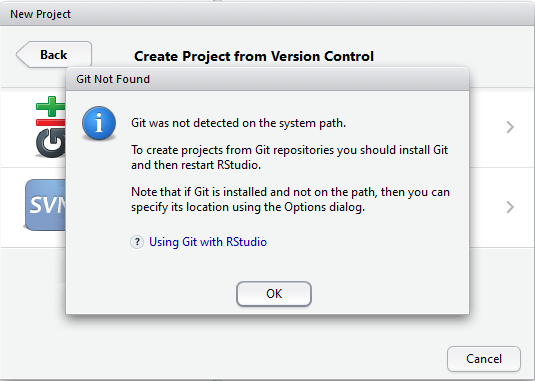

## Download git {data-transition="slide-in fade-out"}

### On Windows:

1. go to https://git-scm.com/download/win.
2. This will automatically download latest version of git. 
3. Choose to 'Run' exe to set up:
    
    - choose "Use Git from the Windows Command Prompt" when asked.

## Download git {data-transition="fade-in fade-out"}

### On Ubuntu:

```{bash, eval = FALSE}
# This PPA provides the latest stable upstream Git version:
add-apt-repository ppa:git-core/ppa
apt update
apt install git
```

(may be adapted depending on your Linux/Unix flavour)

## Download git {data-transition="fade-in slide-out"}

### On Mac OS X:

- Maverick 10.9 or higher - should already be installed
- Otherwise go to https://git-scm.com/download/mac

## Introduce ourselves to git

Now that we have git installed, we want to introduce ourselves.

In RStudio, open the terminal tab in the console pane:

```
git config --global user.name 'Your Name'
git config --global user.email 'your@email.com'
```

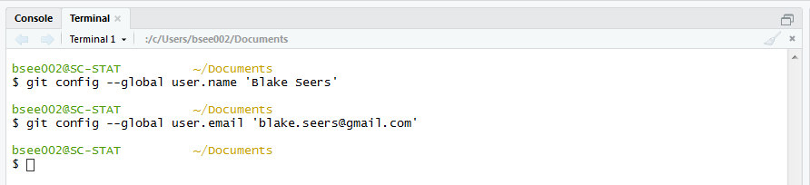

# GitHub

## What is GitHub?

- An online interface for git.
- Allows for cloud-based repository management.
- Connects you to the online community of developers and end users.
- Allows you to access your files from any computer.

## Sign up for GitHub

- Go to https://github.com/join
- Select the 'Unlimited public repositories' for the free option.
- You will get emailed a link to complete the verification process.

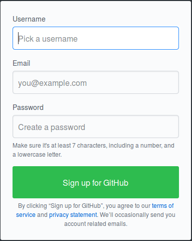

## {data-background-image="figure/github_education.png" data-background-size="56%" data-background-position="top"}

# Secure Shell (SSH) key (optional)

## Create an SSH key in RStudio

 - SSH allows you to connect and authenticate to remote servers.
 - Tools $\rightarrow$ Global options $\rightarrow$ Git/SVN $\rightarrow$ Create RSA Key...

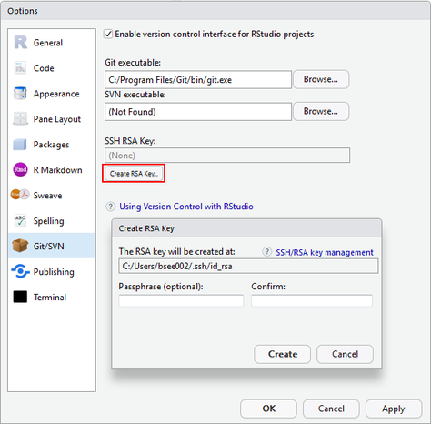
     
## Connect SSH key to GitHub account {data-transition="slide-in none-out"}

Click on "View Public Key" to copy the contents to clipboard.

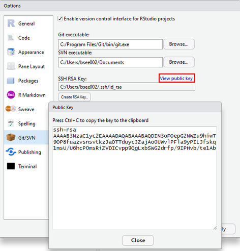

## Connect SSH key to GitHub account {data-transition="none-in slide-out"}

In your browser:

   - go to https://github.com/settings/ssh/new

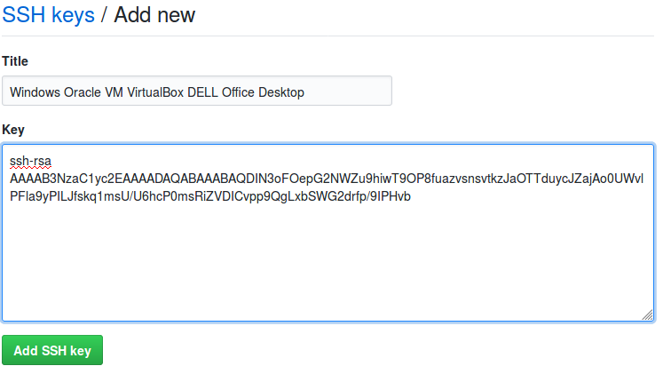

## Check connection

In the Terminal pane, in RStudio:

```
ssh -T git@github.com
```

... and then type `yes` when prompted.

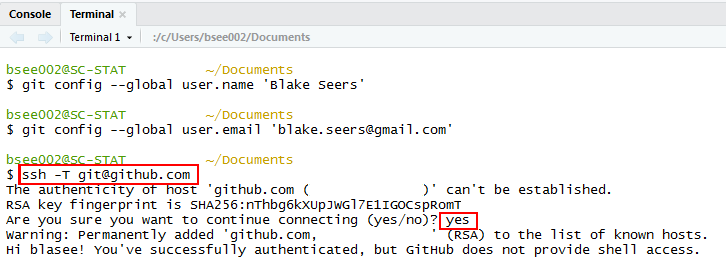

# Core concepts

## Core concepts in git and GitHub

- **Repository**

    + Contains all your files (and history) for the project.
    + One-to-one mapping between **R** project and 'repo'.

- **Commit**

    + Each commit is a snapshot of your files.
    + Equivalent to a saving `FINAL_after_3rd_review.docx`.
    + Can time travel between commits.

- **Staging**

    + Files that have been selected (staged) for a commit.
    
## Core concepts in git and GitHub

- **Push**

    + Making the changes you have made locally (using git) available to the online repository (GitHub).

- **Pull**

    + Updating your local repository to the current version in the online repository.

## Core concepts in git and GitHub

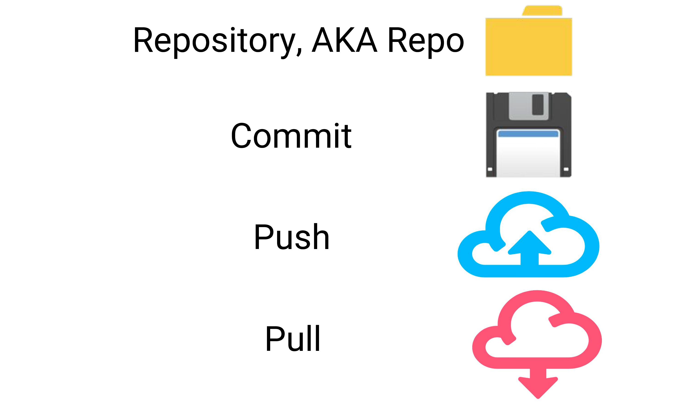

## Core concepts in git and GitHub

- **Clone**

    + Copy (clone) an existing repository locally.
    + For example, working on a project from a different computer.

- **Fork**

    + A personal copy of a repository 'taken' from another user.

## Core concepts in git and GitHub

- **Branch**, **Merge**, and **Conflict**

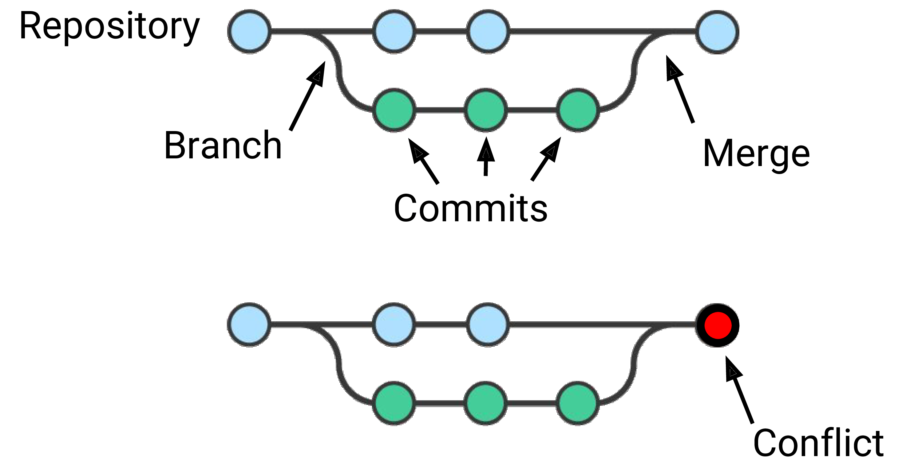

# Examples for getting started with git

## Start a new **R** package

- New Project $\rightarrow$ R Package:

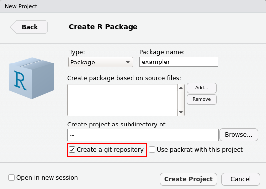

## Initialize an existing repo with git

Tools $\rightarrow$ Project Options $\rightarrow$ Git/SVN:

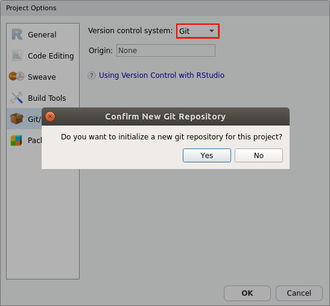

## The git tab

- Once initialized, there is a git tab in RStudio:

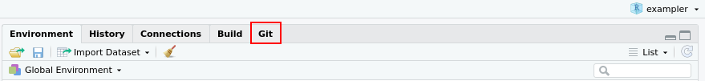

- This git tab in RStudio tab contains all the common git functionality we need.

## Add files to the staging area

- In RStudio just check the boxes to add files to be staged.
- Here we will add all files in an 'initial commit'.

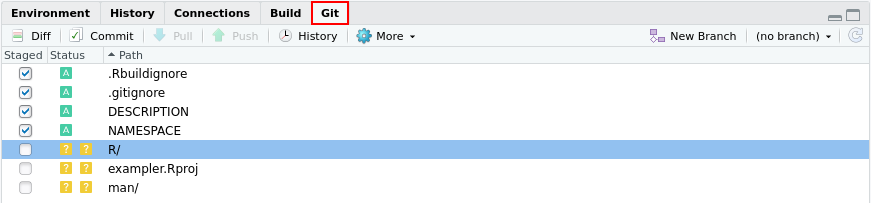

- Press the 'Commit' button when you're ready to commit.
- Shortcut in RStudio: Ctrl + Alt + M.

## An initial commit

- It is common to use 'initial commit' for the first commit message.

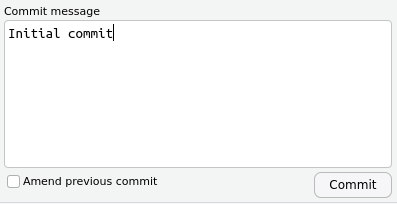

## Modify a file and commit

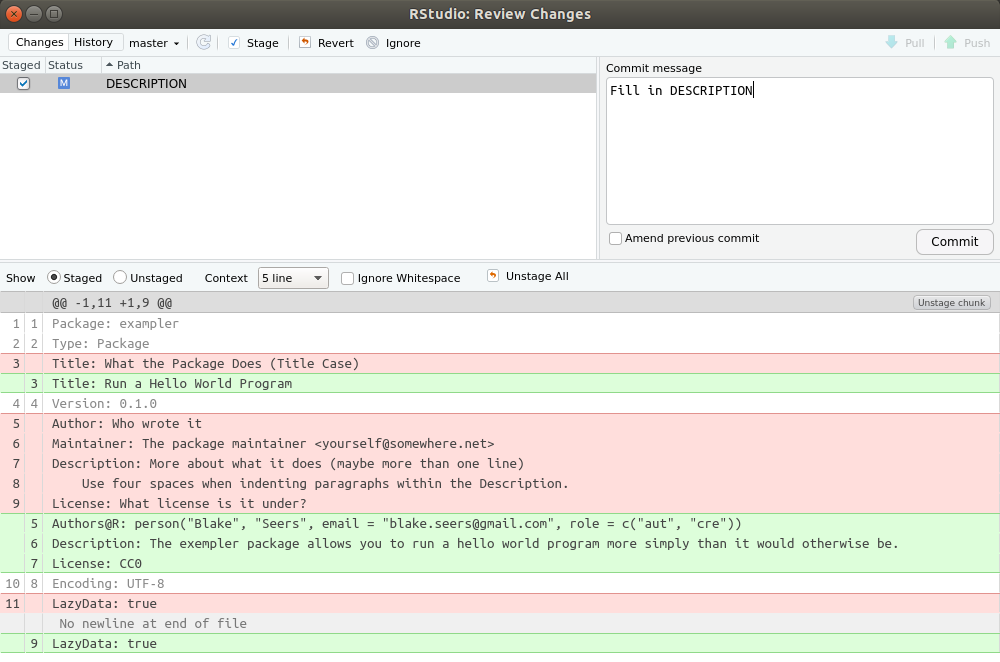

## View a history of commits in RStudio

Now we are ready to add our commits to GitHub.

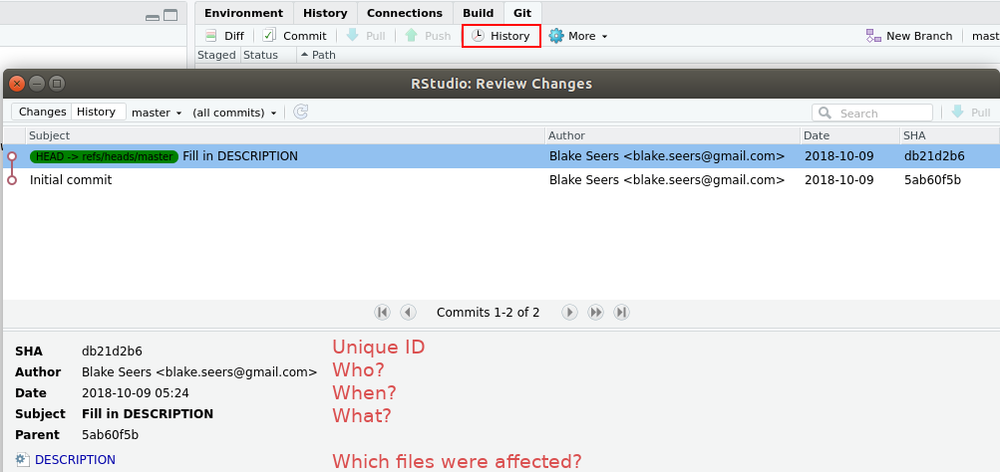

## Create a repo on GitHub {data-transition="slide-in none-out"}

- Go to https://github.com/new to create a new repo:

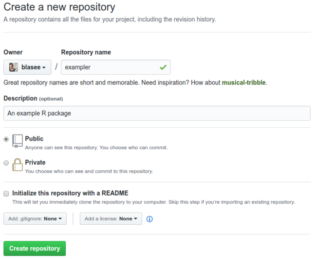

## Create a repo on GitHub {data-transition="none-in slide-out"}

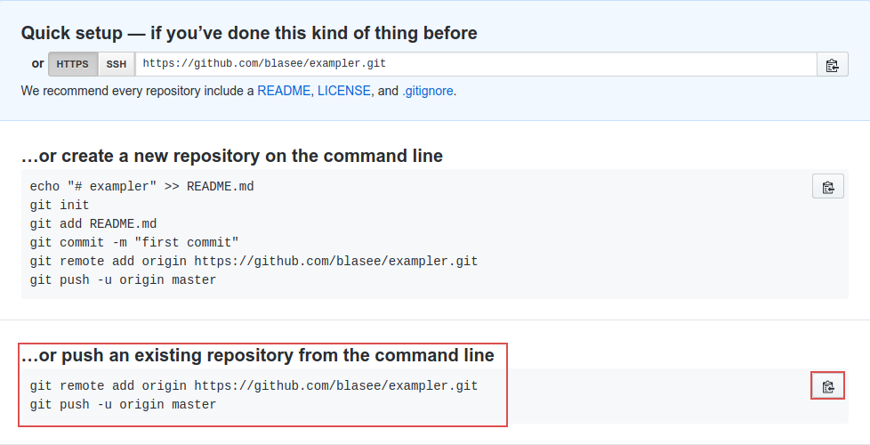

- Simply copy-paste the code to the console in RStudio.

## Package on GitHub

- Your files are now on GitHub!
- `devtools::install_github("blasee/exampler")`

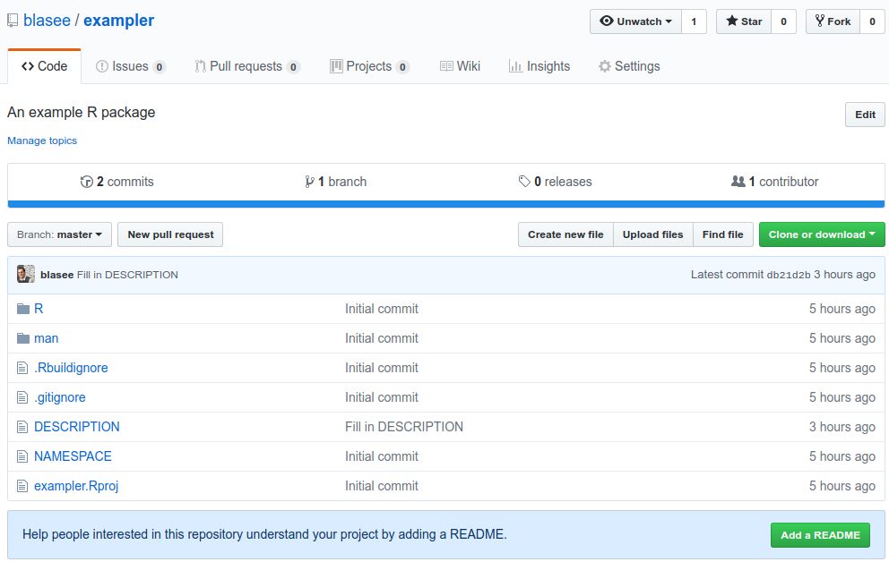

## Push in RStudio

- Just because it is on GitHub, does not mean it is a finished product.
- Can go back to RStudio and continue working, committing, and pushing:

    + to push (or pull) in the future, you can press the "Push" button:
    
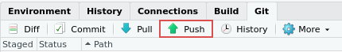

# Forking and cloning repositories

## Fork a repository

- Go to any repository and press 'Fork':

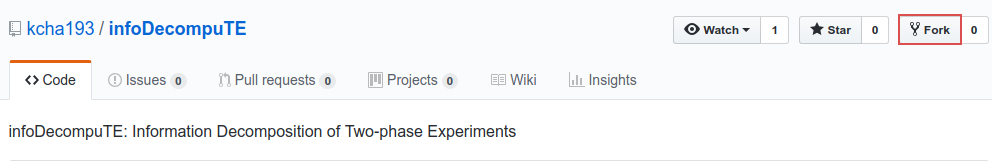

- This repository now lives at https://github.com/blasee/infoDecompuTE

## Clone the repository from RStudio

File $\rightarrow$ New Project $\rightarrow$ Version Control $\rightarrow$ Git

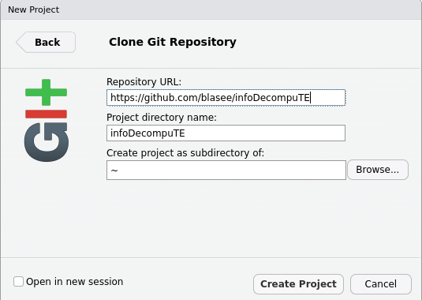

# Concluding remarks

## gitignore files

- Files that match the patterns in gitignore will be ignored by git.
- Similar to Rbuildignore.
- Patterns include:

    + '#' for comments.
    + \\ is the escape character.
    + dir/ ignores the directory 'dir'.
    + \* matches anything (except "/")
    + ? matches anything (except "/" and "\[\]")

## Best practices

Each commit should:

- address a single issue.
- have a helpful commit message.
- use imperitive verbs in the present tense.

    + '*Add* print S4 method to person class'
    + '*Remove* ORIGINAL.csv file from top directory'
    + '*Update* dependency from `XML` to `xml2`'
    + '*Fix* installation problem on Windows'

## Important things not covered

- Creating tags and releases (**R** packages).
- Adding README files to your repository.
- Branching and reverting
- Tracking issues on GitHub
- Pull request on GitHub
- Continouous integration services
- GitHub pages for a website for your repo

## Obtain a PDF of these slides

Go to our repo on GitHub: https://github.com/sccuoa/intro-to-git

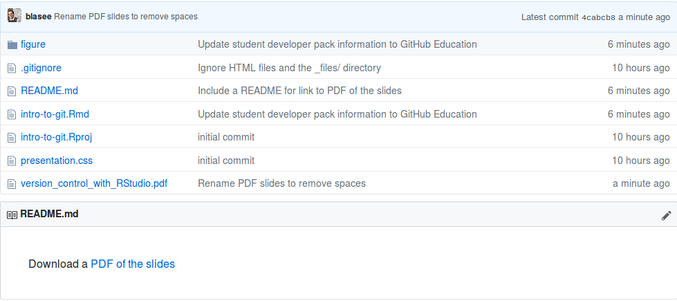

## Summary

- Use version control for your projects:
    
    + **R** packages
    + Thesis / dissertation
    + Course notes
    + Book
    + Website

- Version control is easy with RStudio.
- Code and collaborate with RStudio, git and GitHub!

# {data-background-image="figure/questions.png" data-background-size="50%" data-background-position="bottom"}
